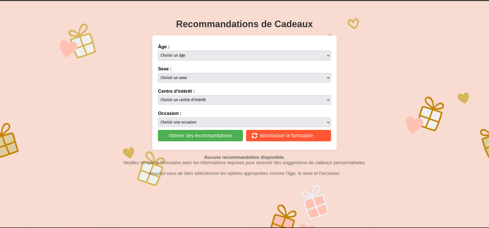

# 🎁 Recommandations de Cadeaux 🎁

## 1. Description du Projet : 

Ce projet est une application web basée sur Flask et Experta pour générer des recommandations de cadeaux personnalisées. L'application utilise un moteur de règles pour fournir des suggestions de cadeaux en fonction des critères saisis par l'utilisateur : âge, sexe, intérêts, et occasion.

## 2. Fonctionnalités Principales
***Formulaire Dynamique*** : Sélectionnez une tranche d'âge pour remplir dynamiquement les options d'intérêts et d'occasions.

***Moteur de Règles*** : Le moteur de règles Experta est utilisé pour générer des recommandations basées sur les faits fournis.

***Affichage des Suggestions*** : Les suggestions de cadeaux sont affichées de manière claire avec des liens vers des sites externes pertinents.

***Partage sur WhatsApp*** : Possibilité de partager les recommandations via un bouton WhatsApp.

## 3. Installation et Configuration

***NB : Utilisez python ou python3 en fonction de la version installée sur votre machine dans toutes les commandes***


### 3.1. **Cloner le projet**
```bash
git clone https://github.com/fatma-bouzouita/recommandation_cadeau.git
cd recommandations-cadeaux
```
### 3.2. **Créer un environnement virtuel** 

Créez un environnement virtuel pour isoler les dépendances :

Sous Linux/macOS :
```bash
python3 -m venv venv
source venv/bin/activate
```
Sous Windows :
```bash
python -m venv venv
venv\Scripts\activate
```
### 3.3 **Installer les dépendances**
Utilisez le fichier requirements.txt pour installer toutes les bibliothèques nécessaires :

```bash
pip install -r requirements.txt
```

## 4. **Exécution de l'application**
Une fois les dépendances installées, lancez le serveur Flask avec la commande suivante :

```bash
python main.py
```
Par défaut, l'application sera accessible à l'adresse suivante :
http://127.0.0.1:5000/ : 



